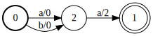
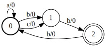

.. _basic_usage:

Basic Usage
===========

Construction
------------

Start by constructing a :cpp:class:`gtn::Graph` and adding nodes and arcs.

::

  Graph graph;

  // Add a start node
  graph.addNode(true);

  // Add an accept node
  graph.addNode(false, true);

  // Add an internal node
  graph.addNode();

  // Add an arc from node 0 to 2 with label 0
  graph.addArc(0, 2, 0);

  // Add an arc from node 0 to 2 with input label 1 and output label 1
  graph.addArc(0, 2, 1, 1);

  // Add an arc from node 2 to 1 with input label 0, output label 0 and weight 2
  graph.addArc(2, 1, 0, 0, 2);

We can visualize the ``graph`` with :cpp:func:`draw`.

By default a :cpp:class:`gtn::Graph` requires a gradient. To disable gradient
computation use the constructer parameter (e.g. ``Graph(false)``) or the method
:cpp:func:`Graph::setCalcGrad`.

Nodes and arcs have unique integer ids in the ``graph``. When you add a node or
an arc you can capture the id as the return value. This can make adding arcs
from node ids simpler in some cases.

::

  Graph g;
  auto n1 = g.addNode();
  auto n2 = g.addNode();
  auto a1 = g.addArc(n1, n2, 0, 1);

Input and Output
----------------

The GTN framework provides some convenience functions to visualize graphs. We
can print them to ``stdout`` or write them to `Graphviz's
<https://graphviz.org/>`_ ``.dot`` format with :cpp:func:`draw`.

::

  // print graph to stdout
  std::cout << graph << std::endl;

  // Draw the graph in dot format to file
  draw(graph, "simple_fsa.dot", {{0, "a"}, {1, "b"}, {2, "c"}});

Graph's in ``.dot`` format can be compiled to different images formats. For
example, to make a PDF image use

::

  dot -Tpdf graph.dot -o graph.pdf

We can save graphs in binary with :cpp:func:`save` or as a text file with
:cpp:func:`saveTxt`. Similarly we can load graphs in binary format with
:cpp:func:`load` or from a text file with :cpp:func:`loadTxt`.

::

  // save in binary format
  save("myGraph.bin", graph);

  // save in text format
  saveTxt("myGraph.txt", graph);

  // load in binary format
  graph = load("myGraph.bin");

  // load in text format
  graph = loadTxt("myGraph.txt");

We can save and load graphs from input streams as well as files. The text
format of the graph is described below.

::

  std::stringstream in(
      // First line is space separated  start states
      "0\n"
      // Second line is space separated accept states
      "1\n"
      // The remaining lines are a list of arcs:
      // <source node> <dest node> <ilabel> [olabel] [weight]
      // where the olabel defaults to the ilabel if it is not specified
      // and the weight defaults to 0.0 if it is not specified.
      "0 2 0\n" // olabel = 0, weight = 0.0
      "0 2 1 1\n" // olabel = 1, weight = 0.0
      "2 1 0 0 2\n"); // olabel = 0, weight = 2.0

  Graph other_graph = load(in);

Comparisons
-----------

There are several ways to compare two graphs in GTN. Use :cpp:func:`equal` to
check for an exact match between two graphs. In this case nodes with the same
id should have the same arcs. The function :cpp:func:`isomorphic` checks that
the graph structures are the same regardless of the actual node ids. This can
be expensive for large graphs.

WFSAs and WFSTs of different structure can be equivalent in the sense that they
accept or transduce the same paths with the same scores. To check this
condition, use :cpp:func:`randEquivalent`. The function
:cpp:func:`randEquivalent` uses a Monte Carlo sampling strategy to assess the
equivalence between two graphs and may incorrectly assume the graphs are
equivalent if not enough samples are used.

Example Graphs
--------------

Graphs in GTN can have multiple start and accept nodes. Start nodes have
bold circles and accepting nodes are denoted by concentric circles in the
figure below.

.. figure:: images/multi_start_accept.svg
   :align: center
   :alt: multi start and accept

Graphs can also have cycles, though not every function supports cyclic graphs.

GTN also allows :math:`\epsilon` transitions in graphs. Use
:cpp:member:`epsilon` to add :math:`\epsilon` labels for arcs.

.. figure:: images/epsilons.svg
   :align: center
   :alt: epsilon fsa
