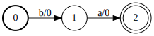
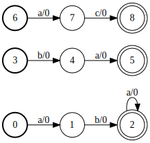
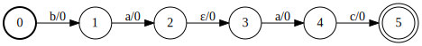
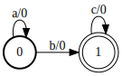
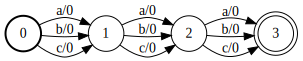

.. _common_functions:

Common Functions
================

GTN supports a range of functions on WFSAs and WFSTs from the simple rational
functions like concatenation two the powerful composition operation. Unless
explicitly noted, every function in GTN is differentiable with respect to its
inputs.

Union
-----

Use :cpp:func:`sum` to compute the union (sum) of a ``std::vector`` of graphs.

The union (or sum) of two graphs :math:`\mathcal{A}_1 + \mathcal{A}_2` accepts
any sequence accepted by either input graph.

.. figure:: images/sum_g1.svg
   :align: center
   :width: 200px

   The ``g1`` recognizes :math:`aba*`.

   The ``g2`` recognizes :math:`ba`.

.. figure:: images/sum_g3.svg
   :align: center
   :width: 200px

   The graph ``g3`` recognizes :math:`ac`.

   The union graph, ``sum({g1, g2, g3})``, recognizes any of :math:`aba*`,
   :math:`ba`, or :math:`ac`.

Concatenation
-------------

Use :cpp:func:`concat` to compute the concatenation of two graphs or a
``std::vector`` of graphs.

The concatenation of two graphs, :math:`\mathcal{A}_1\mathcal{A}_2` accepts any
path :math:`{\bf p}{\bf r}` such that :math:`{\bf p}` is accepted by
:math:`\mathcal{A}_1` and :math:`{\bf r}` is accepted by :math:`\mathcal{A}_2`.

.. figure:: images/concat_g1.svg
   :align: center
   :width: 200px

   The graph ``g1`` recognizes :math:`ba`.

.. figure:: images/concat_g2.svg
   :align: center
   :width: 200px

   The graph ``g2`` recognizes :math:`ac`.

   The concatenated graph, ``concat(g1, g2)``, recognizes :math:`baac`.

Closure
-------

Use :cpp:func:`closure` to compute the Kleene closure of a graph.

The Kleene closure, :math:`\mathcal{A}*`, accepts any sequence
accepted by the original graph repeated 0 or more times (0 repeats is the empty
sequence, :math:`\epsilon`.).

.. figure:: images/closure_input.svg
   :align: center
   :width: 300px

   The graph ``g`` recognizes :math:`aba`.

.. figure:: images/closure_graph.svg
   :align: center
   :width: 300px

   The closed graph, ``closure(g)``, recognizes :math:`\{aba\}*`.

Intersection
------------

Use :cpp:func:`intersect` to compute the intersection of two acceptors.

The intersection, :math:`\mathcal{A}_1 \circ \mathcal{A}_2` accepts any path
which is accepted by both input graphs. The score for a path in the intersected
graph is the sum of the score of the path in each input graph.

   Graph ``g1``.

   Graph ``g2``.

.. figure:: images/simple_intersect.svg
   :align: center
   :width: 300px

   The intersected graph, ``intersect(g1, g2)``.

Compose
-------

Forward Score
-------------

Use :cpp:func:`forward_score` to compute the forward score of a graph.

The forward algorithm computes the log-sum-exp of the scores of all accepting
paths in a graph. The graph must not have any cycles. Use
:cpp:func:`Graph::item` on the output of :cpp:func:`forward_score` to access
the score.

.. figure:: images/simple_forward.svg
   :align: center
   :width: 300px

   The forward score is given by ``forward(g)``.

In the above example the graph has three paths:

- :math:`0 \rightarrow 1 \rightarrow 2 \rightarrow 3`` with a score of 4.6
- :math:`0 \rightarrow 2 \rightarrow 3`` with a score of 5.3
- :math:`1 \rightarrow 2 \rightarrow 3`` with a score of 3.5

The resulting forward score is :math:`\log(e^{4.6} + e^{5.3} + e^{3.5}) = 5.81`.

Viterbi Score
-------------

TODO

Viterbi Path
------------

TODO

