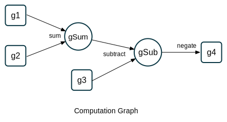

Autograd Basics
===============

Whenever we apply a function on :cpp:class:`gtn::Graph` (s), if at least one of
its inputs requires a gradient, the output :cpp:class:`gtn::Graph` records its
inputs, and a method by which to compute its gradient. The gradients are
computed with a ``GradFunc``, a function that takes the gradient with respect
to the :cpp:class:`gtn::Graph` and computes the gradient with respect to its
inputs.

To recursively compute the gradient of a :cpp:class:`gtn::Graph` with respect
to all of its inputs in the computation graph, call :cpp:func:`gtn::backward`
on the :cpp:class:`gtn::Graph`. This iteratively computes the gradients by
repeatedly applying the chain rule in a reverse topological ordering of the
computation graph.

Here is a simple example

::

  auto g1 = Graph(true);
  g1.addNode(true);
  g1.addNode(false, true);
  g1.addArc(0, 1, 0, 0, 1.0);

  auto g2 = Graph(false);
  g2.addNode(true);
  g2.addNode(false, true);
  g2.addArc(0, 1, 0, 0, 2.0);

  auto g3 = Graph(true);
  g3.addNode(true);
  g3.addNode(false, true);
  g3.addArc(0, 1, 0, 0, 3.0);

  auto g4 = negate(subtract(add(g1, g2), g3));

  g4.backward();

  auto g1Grad = g1.grad(); // g1Grad.item() = -1

  auto g3Grad = g3.grad(); // g3Grad.item() = 1

.. warning::
  Calling ``g2.grad()`` will throw an exception since ``calcGrad`` is set to ``false`` for the graph

**Retaining the Computation Graph**

The :cpp:func:`gtn::backward` function takes an optional boolean parameter,
``retainGraph``, which is ``false`` by default. When the argument is false,
each :cpp:class:`gtn::Graph` is cleared from the computation graph during the
backward pass as soon as it is no longer needed.  This reduces peak memory
usage while computing gradients. Setting ``retainGraph`` to ``true`` is not
recommended unless there is a need to call backward multiple times without
redoing the forward computation.

Let's consider the computation graph that is built with the above example

Assuming we need to call :cpp:func:`gtn::backward` only once on this graph, we
can see that the intermediate Graph ``gSub`` can be deleted as soon as as the
gradients of ``g3`` and ``gSum`` are computed.  This will happen when
``retainGraph`` is set to ``false``.
