.. _common_functions:

Common Functions
================

GTN supports a range of functions on WFSAs and WFSTs from the simple rational
functions like concatenation to the powerful composition operation. Unless
explicitly noted, every function in GTN is differentiable with respect to its
inputs.

Union
-----

Use :cpp:func:`union_` to compute the union of a ``std::vector`` of graphs.

The union of two graphs :math:`\mathcal{A}_1 + \mathcal{A}_2` accepts
any sequence accepted by either input graph.

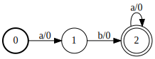

   The ``g1`` recognizes :math:`aba^*`.

.. figure:: images/union_g2.svg
   :align: center
   :width: 200px

   The ``g2`` recognizes :math:`ba`.

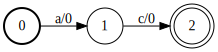

   The graph ``g3`` recognizes :math:`ac`.

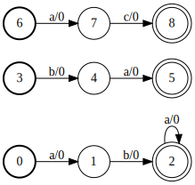

   The union graph, ``union_({g1, g2, g3})``, recognizes any of :math:`aba^*`,
   :math:`ba`, or :math:`ac`.

Concatenation
-------------

Use :cpp:func:`concat` to compute the concatenation of two graphs or a
``std::vector`` of graphs.

The concatenation of two graphs, :math:`\mathcal{A}_1\mathcal{A}_2` accepts any
path :math:`{\bf p}{\bf r}` such that :math:`{\bf p}` is accepted by
:math:`\mathcal{A}_1` and :math:`{\bf r}` is accepted by :math:`\mathcal{A}_2`.

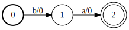

   The graph ``g1`` recognizes :math:`ba`.

   The graph ``g2`` recognizes :math:`ac`.

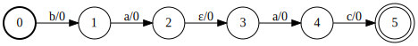

   The concatenated graph, ``concat(g1, g2)``, recognizes :math:`baac`.

Closure
-------

Use :cpp:func:`closure` to compute the Kleene closure of a graph.

The Kleene closure, :math:`\mathcal{A}^*`, accepts any sequence
accepted by the original graph repeated 0 or more times (0 repeats is the empty
sequence, :math:`\epsilon`.).

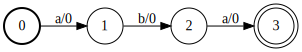

   The graph ``g`` recognizes :math:`aba`.

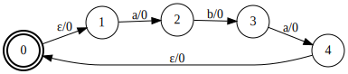

   The closed graph, ``closure(g)``, recognizes :math:`\{aba\}^*`.

Intersection
------------

Use :cpp:func:`intersect` to compute the intersection of two acceptors.

The intersection, :math:`\mathcal{A}_1 \circ \mathcal{A}_2` accepts any path
which is accepted by both input graphs. The score for a path in the intersected
graph is the sum of the scores of the path from each input graph.

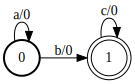

   Graph ``g1``.

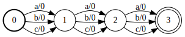

   Graph ``g2``.

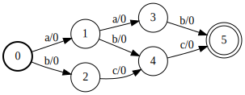

   The intersected graph, ``intersect(g1, g2)``.

Compose
-------

Use :cpp:func:`compose` to compute the composition of two transducers.

The composition, :math:`\mathcal{T}_1 \circ \mathcal{T}_2` transduces
:math:`{\bf p} \rightarrow {\bf u}` if the first input transduces :math:`{\bf
p} \rightarrow {\bf r}` and the second graph transduces :math:`{\bf r}
\rightarrow {\bf u}`. As in intersection, the score of the transduction in the
composed graph is the sum of the scores of the transduction from each input
graph.

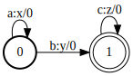

   Graph ``g1``.

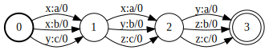

   Graph ``g2``.

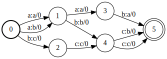

   The composed graph, ``compose(g1, g2)``.

Forward Score
-------------

Use :cpp:func:`forwardScore` to compute the forward score of a graph.

The forward algorithm computes the log-sum-exp of the scores of all accepting
paths in a graph. The graph must not have any cycles. Use
:cpp:func:`Graph::item` on the output of :cpp:func:`forwardScore` to access
the score.

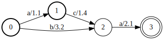

   The forward score is given by ``forwardScore(g)``.

In the above example the graph has three paths:

- :math:`0 \rightarrow 1 \rightarrow 2 \rightarrow 3`` with a score of 4.6
- :math:`0 \rightarrow 2 \rightarrow 3`` with a score of 5.3
- :math:`1 \rightarrow 2 \rightarrow 3`` with a score of 3.5

The resulting forward score is :math:`\log(e^{4.6} + e^{5.3} + e^{3.5}) = 5.81`.

Viterbi Score
-------------

Use :cpp:func:`viterbiScore` to compute the Viterbi score of a graph.

The Viterbi algorithm gives the max of the scores of all accepting paths in
a graph. The graph must not have any cycles. Use :cpp:func:`Graph::item` on the
output of :cpp:func:`viterbiScore` to access the score.

The Viterbi score of the figure in the section `Forward Score`_ is 5.3, the
highest score over all paths.

Viterbi Path
------------

Use :cpp:func:`viterbiPath` to compute the Viterbi path of a graph.

The Viterbi algorithm gives the highest scoring path of all accepting paths in
a graph. The graph must not have any cycles. The output of
:cpp:func:`viterbiPath` is a chain graph representing the highest scoring path.

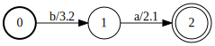

   The Viterbi path of the graph in section `Forward Score`_, computed using
   ``viterbiPath(g)``.
